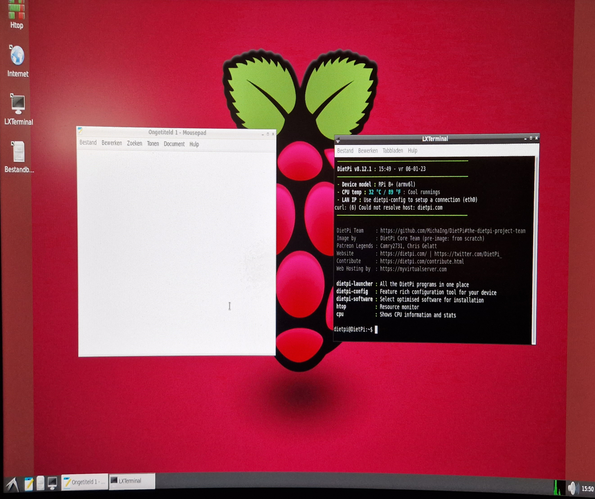

Een Raspberry Pi is een mini-computer waar allerlei leuke dingen mee kunt doen. Behalve als computer gebruiken,
kun je er ook allerlei apparaatjes en elektronische schakelingen aan koppelen.

We gaan met bewegingssensoren, afstandssensoren en een stappenmotor aan de slag. 

<!--more-->

## De Raspberry Pi aansluiten


Zoals gezegd is een Raspberry Pi een mini-computer waar je net als een gewone computer een scherm, toetsenbord en muis
op moet aansluiten.

1. In de doos van de Raspberry Pi zit een HDMI kabel die je op het scherm aansluit en op aansluiting 1.
2. Op USB aansluitingen 2 en 3 sluit je het toetsenbord en de muis aan.
3. Tenslotte pak je de voeding uit de doos en sluit je deze aan op aansluiting 4 en in het stopcontact.

Zodra je de stroom hebt aangesloten, begint de Raspberry Pi op te starten. Als het scherm aanstaat, zie hoe de
computer opstart.

## De software

De Raspberry Pi's die we gebruiken zijn al wat ouder en daardoor niet zo snel. We gebruiken daarom de internet
browser niet, maar werken alleen met editor **MousePad** en de terminal.



Met MousePad maken we de *.py bestanden met daarin de code.
Vervolgens voeren we die uit in de terminal met het commando:

```bash
sudo python3 <scriptnaam>.py
```

## Een LED aansturen
We gaan beginnen met het aanzetten van een led lampje met de Raspberry Pi. Hiervoor hebben we nodig:

1. Een led lampje
2. Een weerstandje (330 ohms)
3. Een paar draadjes
4. Een breadboard

#

We gaan nu eerst de draadjes aansluiten, hoe dat moet is te zien op de afbeelding hieronder. We verbinden de 3.3 volt aansluiting op de Raspberry pi met de onderste rij op het breadboard. We verbinden de GROUND met de rij erboven op het breadboard. Daarna pluggen we de weerstand en het ledje in zoals het op de afbeelding staat. Als laatste verbinden we het weerstand en het ledje met de rijen op het breadboard, en het bruine draadje naar de controller pin op de raspberry pi. 
#
De pins op de afbeelding zijn hetzelfde als op jouw Raspberry Pi, je kan dus tellen waar de draadjes moeten!


Het led lampje gaat nu nog niet branden, dat komt omdat het circuit nog niet compleet is. We hebben net de led aangesloten op de GND en op de controller pin met het bruine draadje. Om het circuit compleet te maken en het ledje aan te laten gaan moeten we de controller pin aanzetten. De pin die wij hebben gebruikt heet: pin 18. We moeten dus met code pin 18 gaan aanzetten. Dit gaan we doen met python als volgt:

```python
from gpiozero import LED
led = LED(18)
led.on()
```

Zoals je kan zien is dit heel simpel. Eerst importeren we de code (gpiozero) om de pin te besturen. Hierna zeggen we dat er een ledje zit op pin 18 met de regel code: LED(18). En daarna zetten we deze led aan. Start het script met: 

```bash
python3 script.py
```

Het ledje zou nu moeten aangaan.
#
#
We kunnen het ledje laten knipperen door de code in ons script te vervangen met:

```python
from gpiozero import LED
from time import sleep
led = LED(18)
while True:
    led.on()
    sleep(1)
    led.off()
    sleep(1)
```

Dit werkt door de led steeds aan en uit te zetten, en het programma te laten pauzeren tussendoor met sleep(1). Door het getal hier aan te passen kan je het sneller of langzamer laten knipperen. Probeer bijvoorbeeld sleep(5) uit!
## Een LED met een schakelaar
De volgende stap is het toevoegen van een echte knop om de LED mee te bedienen. Hiervoor moeten we eerst het onderstaande circuit nabouwen. Dit circuit is al wat lastiger, vraag om hulp als je het nodig hebt!
#


De knop is aangesloten op pin 2 (met het gele draadje op de afbeelding). Als je de knop indrukt is het circuit compleet en staat er spanning op pin 2. Dit kunnen wij uitlezen met python:

```python
from gpiozero import Button
button = Button(2)
while True: 
    if button.is_pressed: 
        print("Button is pressed") 
    else:
        print("Button is not pressed")
```

Dit script laat wat op je scherm zien als je de knop indrukt. Net zoals eerst vertellen we dat er een knop op pin 2 zit met de regel: Button(2). 
De led doet het nu niet meer, deze sturen we namelijk niet maar aan in het script. We combineren nu ons script van net met dit script:

```python
from gpiozero import LED, Button
from signal import pause
led = LED(18)
button = Button(2)
button.when_pressed = led.on
button.when_released = led.off
pause()
```

## Bewegingssensor en buzzer


## Stappenmotor


## Afstandssensor

### Aansluiten

Met een ultrasone sensor kun je de afstand tot bijvoorbeeld je hand meten. In dit deel van de instructie gaan de sensor 
aansluiten op de Pi en er software voor schrijven om uiteindelijk de afstand in centimeters te kunnen weergeven.

In onderstaande schema vind je de componenten en hoe je ze moet aansluiten.


De weerstandjes zijn allemaal 1kOhm met kleurtjes bruin-zwart-rood. 

De ultra-soon sensor wordt gevoed vanuit 5Vdc, maar de IO-pinnen van de Pi ondersteunen maximaal 3.3Vdc. Daarom wordt
de `echo` spanning op het ultra-soon bordje gedeeld met de 3 1kOhm weerstandjes.

### Software schrijven

```python
#!/usr/bin/python3

import PRi.GPIO as GPIO
from time import sleep, time

PIN_TRIGGER = 7
PIN_ECHO = 11
HALVE_GELUIDSSNELHEID = 17150

try:
    GPIO.setmode(GPIO.BOARD)
    GPIO.setup(PIN_TRIGGER, GPIO.OUT)
    GPIO.setup(PIN_ECHO, GPIO.IN)
    
    print("wacht 2 seconden tot de sensor stabiel is")
    sleep(2)
    
    while True:
        print("maak puls")
        print("start een klok zodra het begin van de echo wordt gemeten")
        
        GPIO.output(PIN_TRIGGER, GPIO.HIGH)
        sleep(0.00001)
        GPIO.output(PIN_TRIGGER, GPIO.LOW)
        
        while GPIO.input(PIN_ECHO) == 0:
            puls_start_tijd = time()
            
        while GPIO.input(PIN_ECHO) == 1:
            puls_eind_tijd = time()
        
        print("stop de klok als de echo voorbij is")
        puls_duur = puls_eind_tijd - puls_start_tijd
        afstand = round(puls_duur * HALVE_GELUIDSSNELHEID, 2)
        print(f"gemeten afstand: {afstand}cm\n\n")
        sleep(1)
finally:
    GPIO.cleanup()
```

## Bron

Deze instructie is gebaseerd op het [werk](https://mjrobot.org/rpi-gpiozero/) van Marcelo Rovai en de 
[instructie](https://pimylifeup.com/raspberry-pi-distance-sensor/) van 
Gus van [PiMyLifeUp](https://pimylifeup.com/).

- https://mjrobot.org/rpi-gpiozero/
- https://pimylifeup.com/


